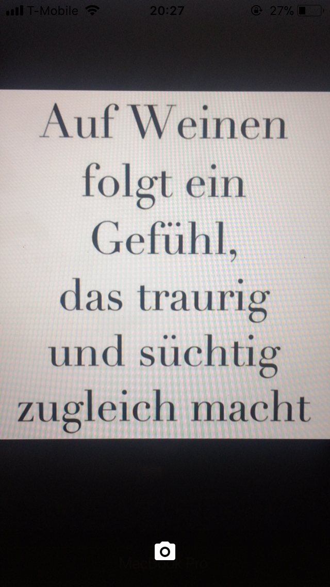
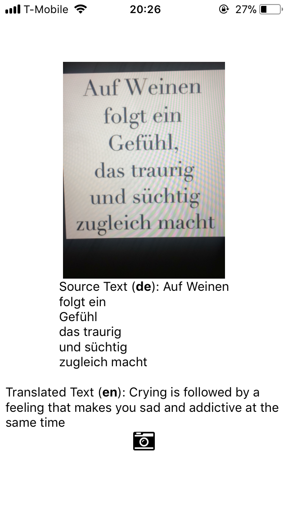

# IMation
Picture to Text Translation using React Native and Expo

## HowTo
Take a picture using the app and it connects to Google Vision and Translation APIs to translate latin scripts type languages to any desired language. The current supported languages are given here: https://en.wikipedia.org/wiki/List_of_languages_by_writing_system#Latin_script

## Example Usage
# Take a Picture

# Screen with Translation (requires remodeling)

